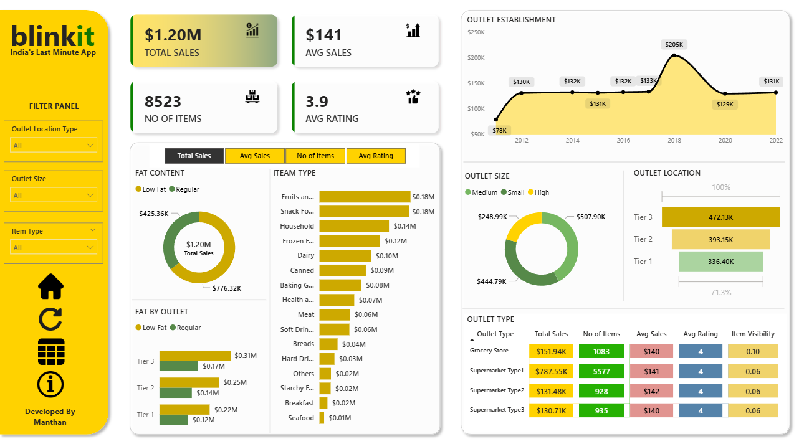

# BlinkIT Sales Analysis Dashboard
## 📊 Dashboard Preview

## 📌 Project Overview
This project analyzes BlinkIT grocery sales using Microsoft Power BI. The dashboard provides insights into sales performance, outlet types, product categories, customer ratings, and business KPIs.

## 🛠️ Tools Used
- Microsoft Power BI
- Microsoft Excel
- Power Query
- DAX
- Data Visualization

## 📊 Key KPIs
- Total Sales: $1.20M
- Average Sales: $141
- Total Items: 8523
- Average Rating: 3.9

## 📈 Dashboard Features
- Interactive Filters (Slicers)
- KPI Cards
- Sales Trend Analysis
- Outlet Performance
- Item Category Analysis
- Outlet Size Analysis
- Customer Rating Analysis

## 📂 Files
- BlinkIT Analysis.pbix
- BlinkIT Grocery Data.xlsx
- BlinkIT Sales Analysis Report.pdf

## 👨‍💻 Author
**Manthan Patel**
